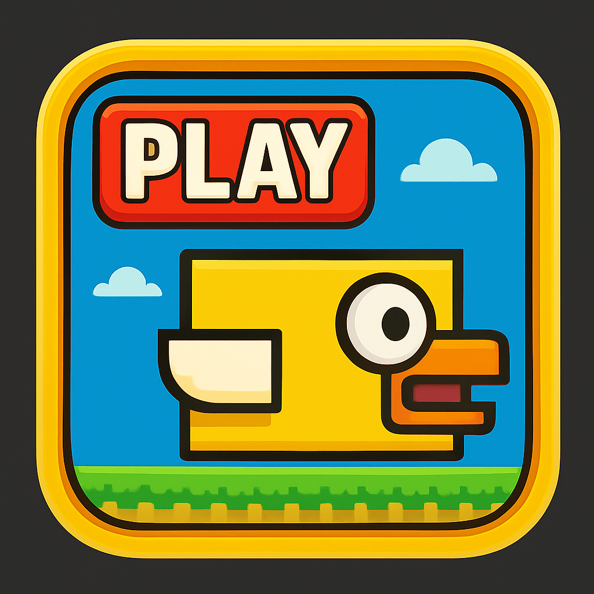
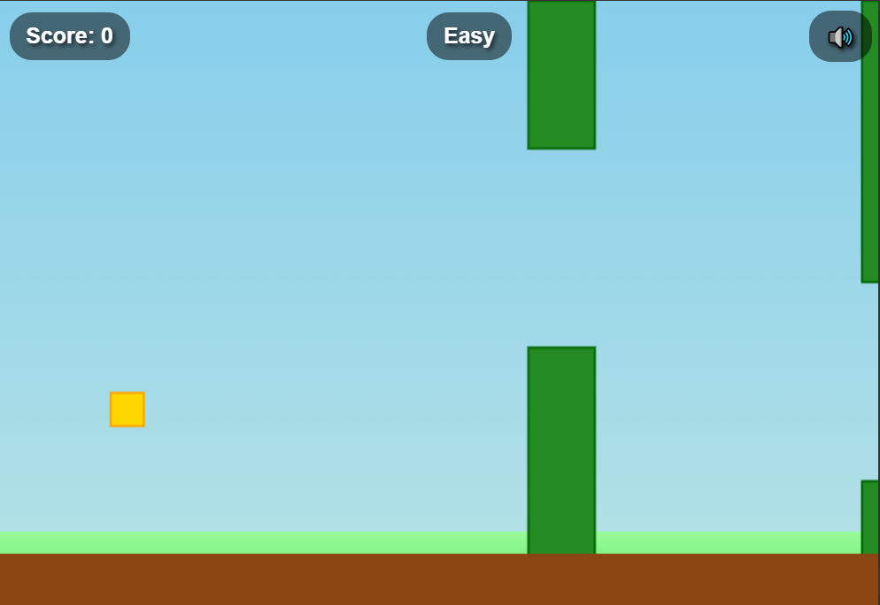
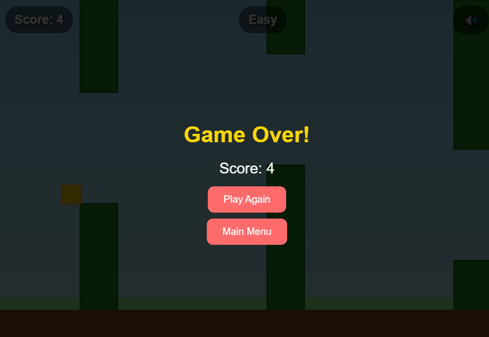
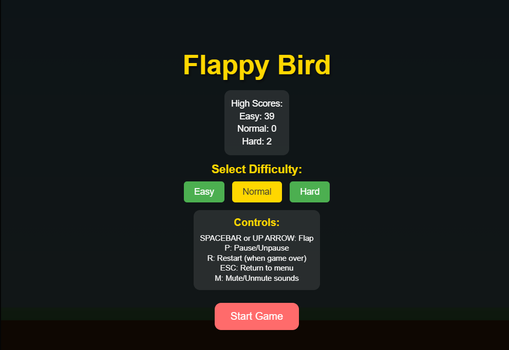

# Flappy Bird - Electron Game



A classic Flappy Bird game built with Electron, featuring multiple difficulty levels, high score tracking, and sound effects.

## Screenshots

### Main Menu


### Gameplay


### Game Over Screen


## Features

- **Multiple Difficulty Levels**: Easy, Normal, and Hard modes with different pipe spacing and speeds
- **High Score Tracking**: Separate high scores for each difficulty level
- **Sound Effects**: Audio feedback for flapping, scoring, and game events
- **Responsive Controls**: Smooth bird movement with spacebar or arrow key controls
- **Pause Functionality**: Pause and resume gameplay at any time
- **Clean UI**: Modern interface with game statistics and controls

## Controls

- **SPACEBAR** or **UP ARROW**: Make the bird flap
- **P**: Pause/Unpause the game
- **R**: Restart when game over
- **ESC**: Return to main menu
- **M**: Mute/Unmute sounds

## Difficulty Levels

- **Easy**: Larger pipe gaps, slower speed - perfect for beginners
- **Normal**: Standard Flappy Bird experience
- **Hard**: Smaller gaps, faster speed - for experienced players

## Installation & Setup

### Prerequisites
- Node.js (v14 or higher)
- npm or yarn

### Installation
1. Clone this repository:
   ```bash
   git clone <repository-url>
   cd flappy-bird
   ```

2. Install dependencies:
   ```bash
   npm install
   ```

3. Run the game:
   ```bash
   npm start
   ```

### Development
To run in development mode with DevTools:
```bash
npm run dev
```

## Building for Distribution

To package the app for your platform:
```bash
npm run build
```

This will create distributable files in the `dist/` directory.

## Project Structure

```
flappy-bird/
├── assets/
│   ├── icon_32_32.png      # App icon
│   ├── icon.png            # Alternative icon
│   ├── screenshot_1.png    # Main menu screenshot
│   ├── screenshot_2.png    # Gameplay screenshot
│   └── screenshot_3.png    # Game over screenshot
├── sounds/                 # Audio files directory
├── game.js                 # Main game logic
├── index.html              # Game HTML structure
├── styles.css              # Game styling
├── main.js                 # Electron main process
├── package.json            # Project configuration
└── scores.json             # High scores storage
```

## Game Mechanics

- **Physics**: Realistic gravity and momentum simulation
- **Collision Detection**: Precise hit detection for pipes and ground
- **Scoring**: Points awarded for successfully passing through pipes
- **Progressive Difficulty**: Game speed increases as score gets higher

## Technical Details

- **Framework**: Electron for cross-platform desktop app
- **Rendering**: HTML5 Canvas for smooth 60fps gameplay
- **Audio**: Web Audio API for sound effects
- **Storage**: Local JSON file for persistent high scores
- **Architecture**: Clean separation of game logic, rendering, and UI

## Contributing

1. Fork the repository
2. Create a feature branch (`git checkout -b feature/amazing-feature`)
3. Commit your changes (`git commit -m 'Add some amazing feature'`)
4. Push to the branch (`git push origin feature/amazing-feature`)
5. Open a Pull Request

## License

This project is open source and available under the [MIT License](LICENSE).

## Acknowledgments

- Inspired by the original Flappy Bird game by Dong Nguyen
- Built with Electron for cross-platform compatibility
- Sound effects and graphics designed for optimal gameplay experience

---

**Enjoy playing Flappy Bird!** 🐦
